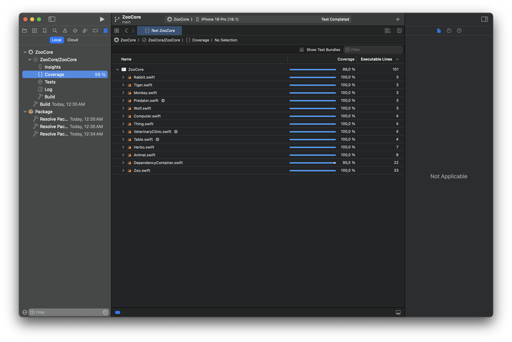

# Zoo App

Это iOS-приложение для управления зоопарком, разработанное с использованием SwiftUI. Вместо консольного приложения было принято решение создать полноценное iOS-приложение с графическим интерфейсом для удобства тестирования.

## Архитектура и SOLID принципы

### Single Responsibility Principle (SRP)
- Каждый класс имеет четкую зону ответственности:
  - `Animal` и его наследники отвечают только за поведение животных
  - `VeterinaryClinic` отвечает только за проверку здоровья животных
  - `Zoo` управляет коллекцией животных и инвентаря
  - ViewModels отвечают за бизнес-логику конкретных экранов

### Open/Closed Principle (OCP)
- Система легко расширяется новыми типами животных через наследование от базовых классов `Animal`, `Predator`, `Herbo`
- Добавление новых типов инвентаря возможно через наследование от `Thing`

### Liskov Substitution Principle (LSP)
- Все наследники `Animal` могут использоваться вместо базового класса
- Все наследники `Thing` могут использоваться вместо базового класса

### Interface Segregation Principle (ISP)
- Используются минимальные интерфейсы:
  - `Living` для живых существ (определяет потребление пищи)
  - `Inventoriable` для инвентаризации

### Dependency Inversion Principle (DIP)
- Зависимости инвертированы через протоколы:
  - `VeterinaryService` абстрагирует работу ветеринарной клиники
- Внедрение зависимостей реализовано через DI-контейнер Swinject

## Dependency Injection

В проекте используется DI-контейнер Swinject для управления зависимостями. Основные регистрации:
- `VeterinaryService` - сервис ветеринарной клиники
- `Zoo` - основной класс, управляющий животными и инвентарем

## Тестирование

Проект покрыт модульными тестами с использованием фреймворка Testing. Тесты охватывают:
- Создание и валидацию животных
- Работу ветеринарной клиники
- Управление зоопарком
- Работу с инвентарем
- Dependency Injection

### Результаты покрытия кода тестами

## Функциональность

1. Добавление новых животных с проверкой здоровья
2. Просмотр списка всех животных
3. Расчет общего потребления пищи
4. Определение животных для контактного зоопарка
5. Управление инвентарем
6. Учет инвентаризационных номеров

## Демонстрация работы

### Управление животными

Демонстрация добавления различных животных и работы контактного зоопарка

### Управление инвентарем

Демонстрация системы учета инвентаря

## Запуск проекта

1. Откройте проект в Xcode 16 или выше
2. Выберите симулятор iOS 18+
3. Нажмите Run (⌘ + R)

## Запуск тестов

1. Откройте `ZooCore/Package.swift` в Xcode
2. Дождитесь индексации проекта
3. Нажмите Test (⌘ + U) или выберите любой тестовый файл и запустите тесты через кнопку ▶️ 